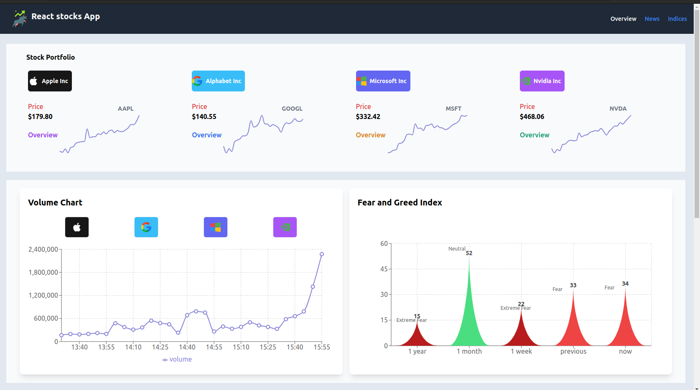

# React Stocks App

React Stocks App is a web application built with React that provides real-time stock market data, including time series, the fear and greed index, actively traded stocks, and their technical indicators.

## Projects Description

- The react stocks app is a stocks information application that displays live prices and technicals of four stocks mainly: AAPL,GOOGL,MSFT,NVDA
- It displays 15minutes live trading volume chart and current fear and greed index of the generals market
- It displays in a tabular format the top 50 most actively traded stocks in the us together with various information for the stocks:price,technicals,fundamentals,performance
- It also displays various current market news and economy news for traders to make informed decisions
- It displays in a tabular format the top 50 major indices around the world together with various information for the indices: price,technicals,fundamentals,performance

## Demo Screenshots

-Desktop View


## Technologies Used

- React
- React Router
- React Query
- React Icons
- Tailwind css
- Recharts Library
- Rapid Api

## Getting Started

To set up the app locally, run the following commands:

```shell

yarn install
yarn dev
```

OR

```shell

npm install
npm run dev
```

Open http://localhost:5000 to view the project in the browser.
Open http://reactstocksapp.netlify.app to view the hosted version

## Disclaimer
